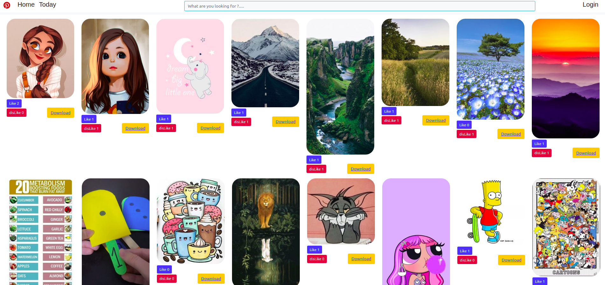
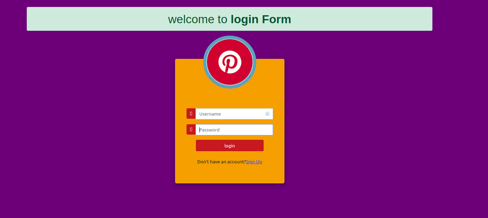
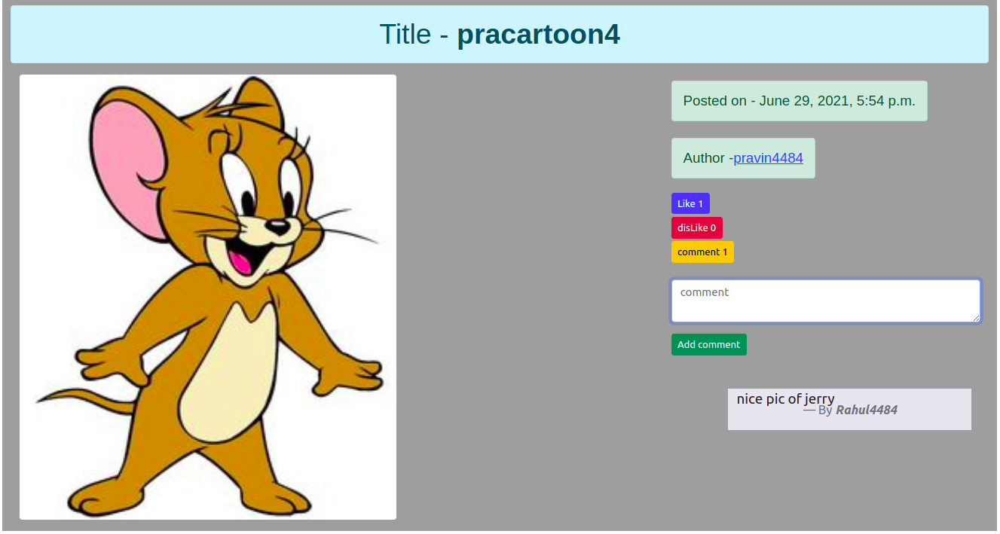
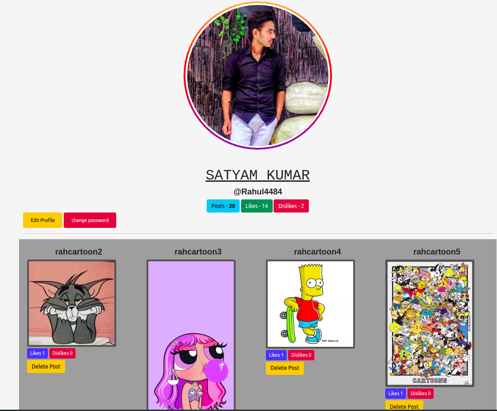
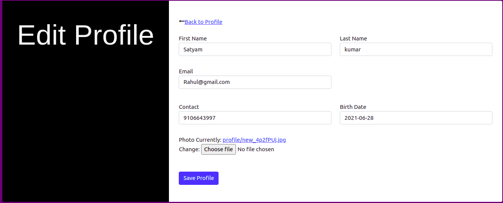

<!--  -->

# Installation Setup
  - ### Create a virutal environment for the project and activate it
    -  #### Windows refer this -- > [windows setup](https://www.stanleyulili.com/django/how-to-install-django-on-windows/)
    - #### Ubuntu refer this ----> [ubutnut setup](https://www.javatpoint.com/django-virtual-environment-setup)
    - #### Mac refer this -------> [mac users setup](https://appdividend.com/2018/03/28/how-to-install-django-in-mac/)
  - You can create a folder for the project can direclty the repo using these ` git clone https://github.com/satyam4484/Pinterest---clone.git` .
  - install required dependies for the project using  ` pip install -r requirements.txt`.
  - make you are in the folder where the file python manage.py exists , then run the command `python manage.py runserver ` to start the server , click the link and you will be redirected to webpage of the project .

___

# Project images 
  - ## Home page 
    - ## These is how the home page looks 
       
    ------
  - ## Login form , Signup form , Password change form
    - ## I have made a common form for all these operations and is linked to single page only
        
    -----
  - ## Post page 
    - ## When a particular user click on post the redirects to these page 
        
    -----
  - ## User Dashboard 
    - ## These image shows user profile page which has various action related to user
        
    ----
  - ## Edit profile form 
    - ## These is the user profile page which edits userprofile as per user requirements
        

# Contributions
  -  I need mostly contributions in the front end part where data should be displayed properly and also if there may be some changes in the backend let me know it will be a leaning for me.

  - Pull requests are welcome. For major changes, please open an issue first to discuss what you would like to change.

<<<<<<< HEAD

=======

>>>>>>> fa0cf27ba8b862fb8291ae57faeeeb1bf8f35fdb
